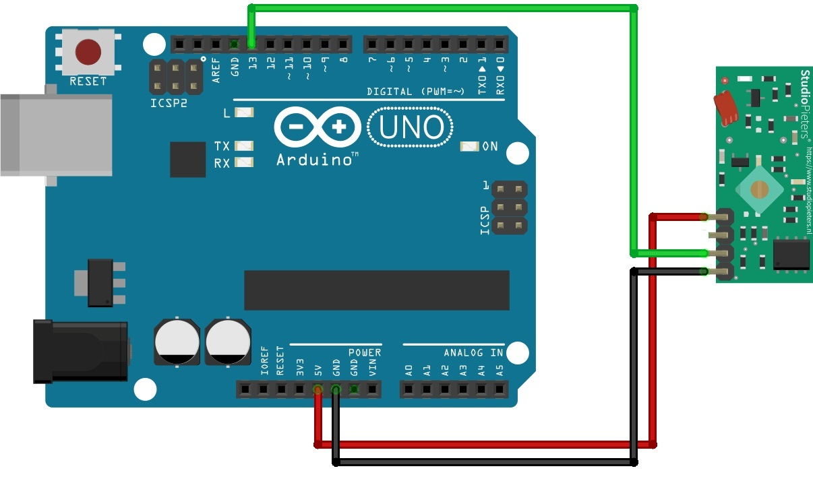

#Librería ReceptorRF

### Descripción

Librería para poder recibir códigos de controles remotos RF o IR de tipo código fijo de 12, 24 u otra cantidad de bits. Por defecto la cantidad de bits esta establecida en 24 bits.

### Conexiones

Por defecto se establece el pin 13 para Arduino UNO, pero este pin se puede cambiar según se desee al momento de declarar el objeto ReceptorRF.

### Funciones de la librería

| Nombre de la función | Descripción                    |
| ------------- | ------------------------------ |
| `configurarRF()`      | Configura el pin de entrada de datos del receptor con el valor declarado en el objeto ReceptorRF.       |
| `obtenerCodigo()`   | Retorna el valor  "0"  si no encuentra ningún código válido o "1" si encuentra un código válido, en caso de encontrar un código válido de un control remoto, lo entrega en una array que debe tener la cantidad de bytes necesarios para poder almacenar el código según sea la cantidad de bit que contenga la trama (12, 24 u otra cantidad).    |
| `deshabilitarRF()` |  Deshabilita el recptor para que no pueda seguir leyendo códigos. Cuando se encuentra deshabilitado el receptor la función obtenerCodigo() devuelve el valor "0". |
| `habilitarRF()` | Habilita el receptor para que pueda volver a leer códigos. |

### Ejemplo básico de uso
```cpp
#include <ReceptorRF.h>

// Definiciones

#define PIN_DATOS 13 // Pin donde está conectado el receptor RF
#define CANT_BITS 24 // Cantidad de bits de la trama (puedes ajustar este valor según tu necesidad)

// Variables
uint8_t codigo[3]; // Arreglo para almacenar el código recibido para 24 bits son 3 bytes

// Crear un objeto receptor de la clase ReceptorRF
ReceptorRF receptor(PIN_DATOS, CANT_BITS);

void setup() {
  Serial.begin(9600); // Iniciar comunicación serial para depuración
  receptor.configurarRF(); // Configurar el receptor RF
  Serial.println("Receptor configurado. Esperando códigos...");
}

void loop() {
  if (receptor.obtenerCodigo(codigo)) { // Intentar obtener un código del receptor
    Serial.print("Código recibido en hexadecimal: ");
    for (uint8_t i = 0; i < 3; i++) {
      Serial.print(codigo[i], HEX);
      Serial.print(" ");
    }
    Serial.println();
    Serial.print("Código recibido en binario: ");
    for (uint8_t i = 0; i < 3; i++) {
      Serial.print(codigo[i], BIN);
    }
    Serial.println();
  }
}
```
### Esquemático


### Licencia

Esta librería fue desarrollada por el Ing. Juan Manuel Mercadin, y la misma puede ser copiada, modificada, adaptada y utilizada por cualquier persona que así lo desee.
